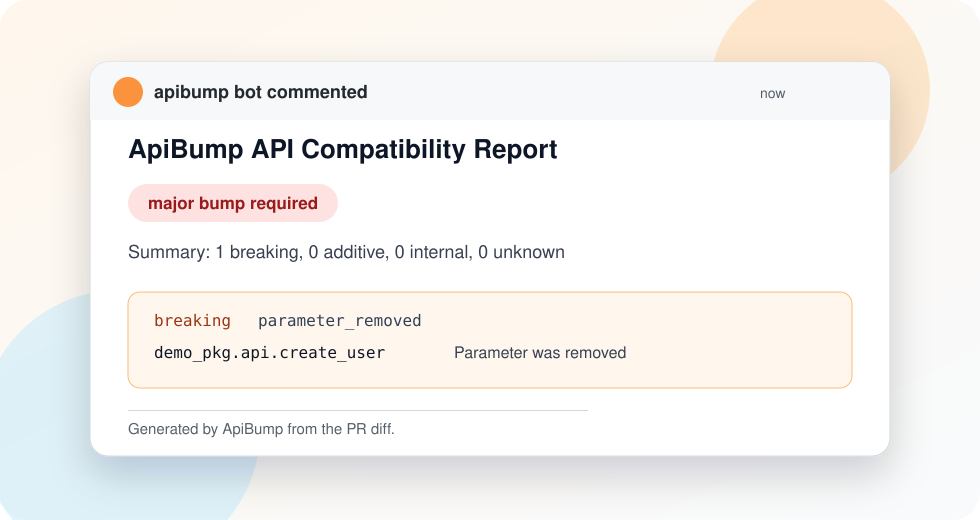

# ApiBump

[](https://github.com/anasm266/apibump/actions/workflows/ci.yml)
[](https://github.com/anasm266/apibump/releases)
[](https://crates.io/crates/apibump)
[](LICENSE)

Know whether a pull request requires a major version bump before merging.

ApiBump detects semantic public API changes and recommends the correct SemVer bump. V1 is intentionally focused: a Rust CLI, a GitHub Action, and a Python backend powered by [Griffe](https://mkdocstrings.github.io/griffe/).



## Quick Start

Add this to a Python library repo:

```yaml
name: API compatibility

on:
  pull_request:

permissions:
  contents: read
  pull-requests: write

jobs:
  apibump:
    runs-on: ubuntu-latest
    steps:
      - uses: actions/checkout@v5
        with:
          fetch-depth: 0

      - uses: anasm266/apibump@v1
        with:
          package: my_pkg
          search: src
          base: ${{ github.event.pull_request.base.sha }}
          head: ${{ github.sha }}
```

ApiBump writes a job summary, annotates the workflow, and updates one sticky PR comment.

## Local Usage

Install the CLI:

```bash
cargo install apibump
```

Install Griffe in the Python environment ApiBump should use:

```bash
python -m pip install "griffe>=1,<2"
```

Run a check:

```bash
apibump check \
  --language python \
  --package my_pkg \
  --search src \
  --base origin/main \
  --head HEAD \
  --format markdown \
  --fail-on breaking
```

Stable JSON output is available with `--format json`:

```json
{
  "schema_version": "0.1",
  "recommendation": "major",
  "summary": {
    "breaking": 1,
    "additive": 0,
    "internal": 0,
    "unknown": 0
  },
  "changes": [
    {
      "severity": "breaking",
      "kind": "parameter_removed",
      "symbol": "my_pkg.api.create_user",
      "file": "src/my_pkg/api.py",
      "line": 42,
      "message": "Parameter was removed",
      "backend": "griffe"
    }
  ]
}
```

## GitHub Action

Full workflow:

```yaml
name: API compatibility

on:
  pull_request:

permissions:
  contents: read
  pull-requests: write

jobs:
  apibump:
    runs-on: ubuntu-latest
    steps:
      - uses: actions/checkout@v5
        with:
          fetch-depth: 0

      - uses: anasm266/apibump@v1
        with:
          language: python
          package: my_pkg
          search: src
          base: ${{ github.event.pull_request.base.sha }}
          head: ${{ github.sha }}
          comment: true
```

The action writes a job summary and updates one sticky PR comment. PR comments use GitHub's issue comments API because pull requests are issues in the REST API.

## Demo Fixture

The `fixtures/python-breaking` example shows the core workflow:

- `base/` has `create_user(name, email)`.
- `head/` removes the public `email` parameter.
- ApiBump reports `parameter_removed` and recommends `major`.

See [docs/demo/apibump-report.json](docs/demo/apibump-report.json) and [docs/demo/apibump-report.md](docs/demo/apibump-report.md) for the expected output shape.

## Exit Codes

- `0`: check completed and did not violate the configured `--fail-on` policy.
- `1`: check completed and violated `--fail-on`.
- `2`: CLI usage, I/O, serialization, or strict backend failure.

By default, backend failures become an `unknown` report and do not fail `--fail-on breaking`. Use `--strict` or `--fail-on unknown` for stricter CI.

## Scope

ApiBump currently supports Python only. It does not yet detect additive Python API changes, so Python reports are either `major`, `patch`, or `unknown`. Future language adapters should normalize their findings into the same JSON schema.
